# 14 - Local Knowledge Graph Map

Entity-relationship structure connecting the business to its services, geography, content, and proof. Existing nodes verified in code; missing nodes marked.

```mermaid
graph TD
    Org["Organization: Boise Remodeling Co (#organization)"]
    LB["LocalBusiness / HomeAndConstructionBusiness (#localbusiness)"]
    Site["WebSite (#website)"]
    Founder["Person: Jared Brost (NEW - this pass)"]
    Cred["Credential: ID contractor registration (MISSING - owner)"]
    GBP["GBP listing (MISSING - unverified)"]

    Org --> LB
    Org --> Site
    Org --> Founder
    Org -.-> Cred
    LB -.-> GBP

    subgraph services [Services]
        Kitchen[Kitchen Remodel]
        Bath[Bathroom Remodel]
        Whole[Whole-Home Remodel]
        Addition[Room Addition]
        ADU[ADU / Guest House]
    end
    LB --> Kitchen
    LB --> Bath
    LB --> Whole
    LB --> Addition
    LB --> ADU

    subgraph geo [Geography]
        Ada[Ada County]
        Canyon[Canyon County]
        Boise[Boise + 10 ZIPs]
        Meridian[Meridian + 2 ZIPs]
        Eagle[Eagle]
        Nampa[Nampa]
        Kuna[Kuna]
        Star[Star]
        Middleton[Middleton]
        Caldwell[Caldwell]
        Hoods["Neighborhoods: North End, Bench, Harris Ranch, Lochsa Falls, Tuscany..."]
        Marks["Landmarks: Capitol, Greenbelt, Village at Meridian..."]
    end
    LB -->|areaServed + Wikipedia sameAs| Boise
    LB --> Meridian
    LB --> Eagle
    LB --> Nampa
    LB --> Kuna
    LB --> Star
    LB --> Middleton
    LB --> Caldwell
    Ada --- Boise
    Ada --- Meridian
    Ada --- Eagle
    Ada --- Kuna
    Ada --- Star
    Canyon --- Nampa
    Canyon --- Middleton
    Canyon --- Caldwell
    Boise --- Hoods
    Boise --- Marks

    subgraph content [Content Layer]
        Pillars["9 hub pillars + ADU pillar (NEW)"]
        CityGuides[8 city guides]
        HoodGuides[6 neighborhood guides]
        Clusters[69 blog clusters]
        Permit[Ada/Canyon permit resource]
        FAQs["FAQPage nodes (all landing pages)"]
    end
    Kitchen --> Pillars
    ADU --> Pillars
    Boise --> CityGuides
    Hoods --> HoodGuides
    Pillars --> Clusters
    Ada --> Permit
    Canyon --> Permit

    subgraph proof [Proof Layer]
        Testi["4 testimonials (Boise, Meridian, Eagle, Nampa)"]
        Projects[5 gallery projects]
        Reviews["Google reviews (MISSING - 0)"]
        ProofGap["Kuna / Star / Middleton / Caldwell proof (MISSING)"]
    end
    LB --> Testi
    LB --> Projects
    LB -.-> Reviews
    LB -.-> ProofGap
```

## Relationship inventory

Strong (in schema today): Org↔LB↔WebSite @id graph; LB→services (`hasOfferCatalog`); LB→8 cities (`areaServed`); content→services/cities (internal-link manifest, 1,030 edges); FAQ→pages.

Added this pass: Org→Founder (Person); cities→Wikipedia (`sameAs` disambiguation); Org→topics (`knowsAbout`); ADU pillar node + its cluster edges.

Missing nodes (owner-gated): GBP listing (the hub node of local search - everything else corroborates it); contractor registration credential; Google reviews; proof for 4 cities; association memberships (NARI/BCA); video assets.

Missing relationships worth building: neighborhood→city-service edges beyond Boise (Meridian/Eagle neighborhood guides, phase 2); project→neighborhood tagging (case-study format per 11-eeat-audit.md); review→city/service tagging (08-review-strategy.md).

## How engines consume this
Google: GBP + LocalBusiness schema + citations triangulate the entity → Local Pack eligibility. Generative engines: `sameAs` graph + `knowsAbout` + consistent NAP + attributable authored content → "Boise Remodeling Co" becomes a resolvable entity they can safely recommend. Today the graph's on-site half is solid; its off-site half (GBP, citations, reviews) is nearly empty - which is why GBP recovery is the roadmap's first item.
