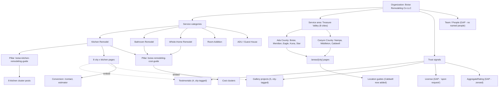

# Content Knowledge Graph

A visual + structural map of how the business, services, locations, content, and proof relate.

## Entity graph (current + recommended)

Dashed `embed` edges (testimonials/projects → city×service pages) are **new** in this pass — previously proof was not surfaced on landing pages.

## Knowledge ecosystem layers

1. **Brand layer** — Organization entity (homepage/about). Needs `logo`, `alternateName`, GBP `sameAs`, named people.
2. **Service layer** — 5 services, each with a pillar guide + cluster posts + 8 city pages.
3. **Geographic layer** — 8 cities (Ada/Canyon split), area pages + location guides.
4. **Proof layer** — testimonials + gallery + (gated) reviews/ratings.
5. **Conversion layer** — estimator, consult CTA, contact.

## Relationship inventory (summary)

| Relationship | State |
|---|---|
| Company → Services | Strong (hasOfferCatalog + service pages) |
| Service → Pillar guide | Strong (10 hubs) |
| Pillar → Clusters | Strong (forced manifest links) |
| Service → City pages | Strong (40 pages) |
| City → Local proof | **Weak → improving** (embedding added; only 4/8 cities have proof data) |
| Company → People | **Missing** (no Person entities) |
| Company → GBP/Google | **Missing** (no sameAs) |
| Service → Reviews (marked up) | **Missing → fixed** (Review schema wired) |

Detailed breakdown in [entity-relationship-map.md](entity-relationship-map.md).
