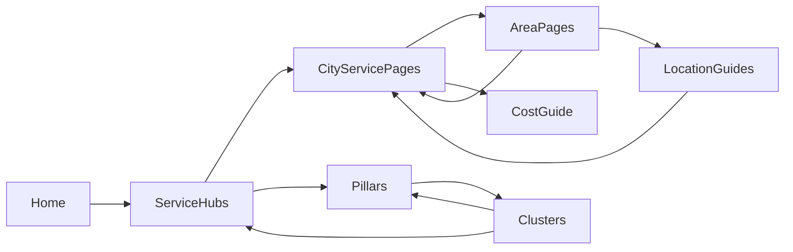

# Internal Link Map (Audit + Strategy)

Combines the internal-linking audit and the recommended linking strategy.

## Link graph at a glance (`data/internal-links.json`)

- **145 pages**, **1,022 outbound links** (avg 7.05/page), **0 broken**, **0 manifest orphans**.
- Generator: `scripts/internal-links/generate.ts` + scoring in `scripts/internal-links/lib.ts` (Jaccard similarity + hub/service/city bonuses + type quotas + min-incoming floor).
- Runtime: `lib/internal-links.ts` → `getManifestLinks(path)`.

## Incoming-link distribution

| Type | Pages | Avg incoming | Min | Max |
|---|---|---|---|---|
| blog | 69 | 4.84 | 2 | 5 |
| guide | 23 | 10.43 | 5 | **74** |
| service | 5 | 27.60 | 12 | 43 |
| city | 8 | 7.63 | 5 | 17 |
| city-service | 40 | 6.22 | 5 | 29 |

## Issues

### 1. Overlinked: cost guide (74 incoming) — MEDIUM
`/guides/boise-remodeling-cost-guide` receives ~10.5× the site average. Equity dilution + unnatural pattern.
**Fix:** cap incoming or reduce its similarity-bonus dominance in `lib.ts`.

### 2. Underlinked: outdoor-living clusters — MEDIUM
`/blog/outdoor-kitchens-boise` and `/blog/luxury-outdoor-living` sit at only 2 incoming each (5 others at 4). Weakest link equity hub.
**Fix:** hub-specific boost or manual `relatedLinks` overrides.

### 3. ADU city×service at the floor — LOW
All 8 ADU city pages sit at exactly 5 incoming (the algorithm floor). Tied to the thin ADU cluster (see service-cluster-map.md).

### 4. Index pages outside the graph — LOW
`/`, `/about`, `/contact`, `/testimonials`, `/resources`, `/blog`, `/guides`, `/areas`, legal pages are not in the 145-page manifest. They get discovery only via nav/footer + `RelatedLinks` `ExploreFurther` (which does feed `/testimonials` and `/resources`).
**Fix:** acceptable for nav-reachable pages; optionally extend the manifest to index pages.

### 5. Dead component — LOW
`components/seo/ManifestRelatedLinks.tsx` is never imported. **Removed this pass.**

### 6. Guide link truncation — LOW
Guides compute 8 manifest links but `RelatedPostCards` caps at 6. **Raised guide limit to 8.**

### 7. Stale manifest statuses — LOW
4 `CONTENT_MANIFEST` entries marked `planned` are actually live posts. **Reconciled to `published`.**

## Recommended linking strategy (hub-and-spoke, balanced)

Principles:
1. **Cap any single target** at ~2.5× site average incoming (≈18) to prevent over-linking.
2. **Floor every page** at 5 incoming (already enforced).
3. **Boost thin clusters** (outdoor-living, ADU) until they reach the floor naturally via content.
4. **Cross-link county peers** (Canyon: Nampa↔Caldwell↔Middleton) to reinforce regional clusters.
5. Regenerate via `npm run links:generate` and validate with `npm run audit:links` after content changes.
